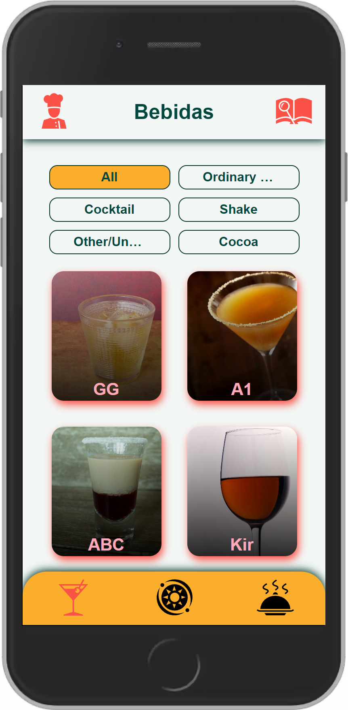

# Recipes App

This project was developed in the last frontend module at Trybe Course. The base code
was created by Trybe itself for evaluative purposes.

## Features

- Specific filters to search recipes
- Search recipes by name, ingredients or first letter
- Explore food recipes by ingredients or origin location
- Explore drink recipes by ingredients
- "Surprise me!" with a random recipe
- Save recipes as favorite and show it on the favorite recipes page
- Copy link to recipe
- Save recipe progress and show it on the recipes made page when it is finished

## Tech Stack

**Client:**

- [React](https://reactjs.org)
- [Context API](https://reactjs.org/docs/context.html)
- [Sass](https://sass-lang.com/)
- [Axios](https://axios-http.com/)
- [PropTypes](https://www.npmjs.com/package/prop-types)

**Server:**

- [Free Meal API](https://www.themealdb.com/api.php)
- [Free Drink API](https://www.thecocktaildb.com/api.php)

## Demo

- [Web App](https://try-foods.vercel.app/)
- [Wireframe developed by Trybe](https://www.figma.com/file/urRQ6JMSTnXrBUkZIxq5Gw/Recipes-App?node-id=0%3A1)

## Screenshots

<div align="center">
  <div>
    
    
  </div>

  <div>
    
    
  </div>
</div>

## Run Locally

Clone the project

```bash
  git clone git@github.com:ScriptCamilo/trybe-recipes-app.git
```

Go to the project directory

```bash
  cd trybe-recipes-app
```

Install dependencies

```bash
  npm install
```

Start the server

```bash
  npm run start
```

## Authors

- [@Rodrigo Camilo](https://www.github.com/ScriptCamilo)
- [@Victor Canto](https://www.github.com/victorcanto)
- [@Samuel Melo](https://www.github.com/samuelmmjr)
- [@Nilson dos Santos](https://www.github.com/nyxnil)
- [@Roberto Nascimento](https://www.github.com/robertonatividade)

## License

[MIT](https://choosealicense.com/licenses/mit/)
